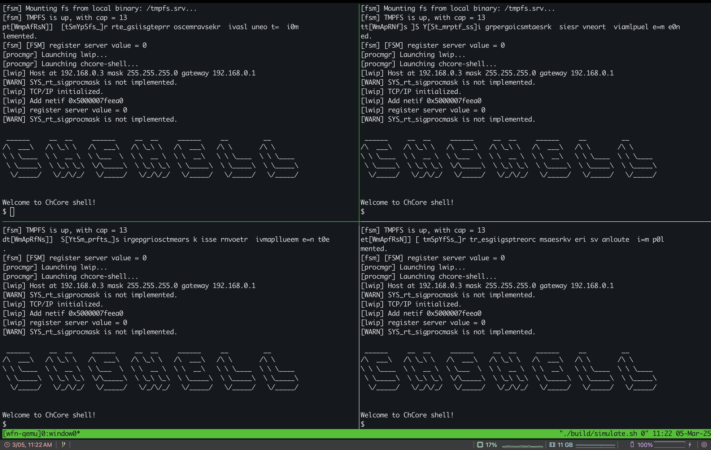

# TreeSLS: A Whole-system Persistent Microkernel with Tree-structured State Checkpoint on NVM

TreeSLS is a microkernel with transparent whole-system persistent support by quickly checkpointing every state in the system.

## Publication

Fangnuo Wu, Mingkai Dong, Gequan Mo, Haibo Chen. TreeSLS: A Whole-system Persistent Microkernel with Tree-structured State Checkpoint on NVM. The 29th ACM Symposium on Operating Systems Principles (SOSP 2023).

## Getting Started

First, clone the repo and checkout the ae branch:

```
git clone https://ipads.se.sjtu.edu.cn:1312/opensource/treesls.git
cd treesls
```

After first clone, you need to run the following command to prepare the environment:

```shell
make prepare
```

To build the OS, you can use:

```shell
make b # build without clean
```

or 

```shell
make ba # fisrt clean all and then build
```

### Run in QEMU

```shell
make r
```

To run several clusters, you can use:

```shell
make r2 # 2 clusters
make r4 # 4 clusters
```

After running, you are expected to see the following output:



To quit, you can use `<tmux-prefix> + :kill-session` to kill the whole tmux session.

Or bind `C-q` to kill the whole tmux session in `~/.tmux.conf`.


### Docker

By default, we provide a pre-built Docker image, you can simply use the build command and it will be automatically downloaded. 

If you want to build this image from scratch, you can use the following command to build from the provided dockerfile.

```shell
docker build -t <image_name> .
```

To use the newly built container, you can modify the Docker image name in the `chbuild` file (specifically, line 218 in the `_docker_run()` function) to the image you have built.

## Artificial Evaluation

Please refer to [artificial_eval.md](./artificial_eval.md)

## File Tree

```
|- artificial_evaluation    scripts for artificial evaluation
|- build
    |- treesls.iso          built os image
    |- simulate.sh          qemu simulation script
|- images                   provided os images with different setups
|- kernel                   
    |- ckpt                 treesls checkpoint code
    |- others               other kernel modules
    |- sls_config.cmake     kernel flags related to treesls
|- scripts                  building scripts
|- tests                    some tests
|- user
    |- demos                ported real-world applications
    |- musl-1.1.24          libc for treesls
    |- sample-apps          some small applications
    |- sys-include          headers for userspace system servers
    |- system-servers       userspace system servers
    |- config.cmake         user applications flags
```

### TreeSLS's Implementation

Please refer to [TreeSLS.md](./docs/TreeSLS.md)

## LICENSE

LICENSE of ported applications are given in subdirs.
