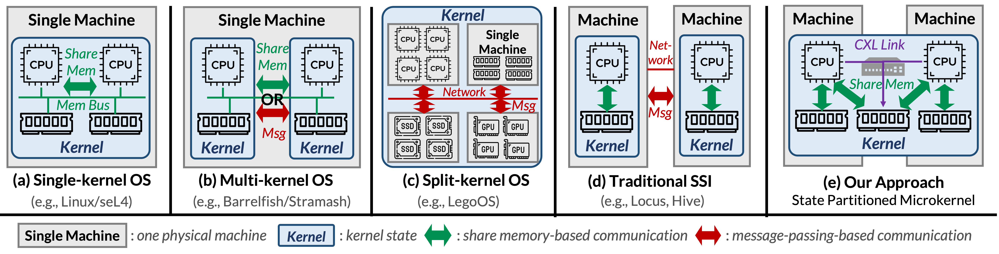
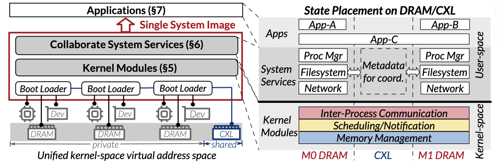

# 1. Design overview

Starfish makes a CXL pod look like one machine to an existing shared-memory application. It avoids making all OS state global: the state-partitioned microkernel puts only cross-machine coordination state in shared CXL memory and preserves local execution for the common case.



*Figure 1. The motivation for Starfish: CXL makes coherent shared-memory coordination available across machines. The complete Starfish architecture diagram is available as .* 

## Execution model

A MapReduce-style program needs to place workers on remote CPUs, access one filesystem namespace, allocate shared buffers, and wake remote workers. Starfish supplies this stack:

```text
application threads
        │ POSIX / libc
collaborative user-space services  ← global process, file, and device views
        │ capability IPC
unified kernel modules             ← IPC, scheduler, notification, memory
        │
private DRAM per machine + shared CXL memory
        │
per-machine boot and QEMU/KVM/ivshmem platform
```

## State partitioning

| Component | Shared CXL state | Local/private state |
| --- | --- | --- |
| IPC/notification | remote queues and shadow-thread metadata | fast paths and executing context |
| Scheduler | remote ready queues and transfer context | local run queues |
| Memory manager | CXL allocator metadata and shared pages | DRAM pools and per-CPU caches |
| System services | coordination/recovery metadata | service instance state |
| Applications | state needed across a migration boundary | normal heap, stacks, and local data |

The placement controls live in [kernel/dsm_config.cmake](../kernel/dsm_config.cmake): DSM allocation mode, thread-context/page-table/stack placement, device-backed DRAM, lock-free CXL buddy allocation, and optional slab recovery.

## Prototype platform

The target model has private DRAM at every x86 machine and one coherent CXL memory pool. The artifact uses QEMU/KVM plus file-backed ivshmem to emulate it. [build/simulate.sh](../build/simulate.sh) manages:

- `/dev/shm/ivshmem-$USER`: CXL shared memory;
- `/dev/shm/ivshmem-hostfs-$USER`: hostfs backing memory;
- `/dev/shm/numa*-$USER`: optional device-backed local DRAM;
- `/tmp/ivshmem-doorbell-$USER`: remote-interrupt socket.

The default is one 12-vCPU guest and a 32 GiB CXL backing file. `MACHINE_NUM`, `CPU_NUM`, `CXL_SIZE`, and `USE_DEV_AS_DRAM` are launch-time overrides. `dsm-scripts/config_memdev.sh` creates/resets backing files; `artifact-evaluation/prepare.sh` performs complete evaluation setup.

## Boot and failure model

[kernel/arch/x86_64/main.c](../kernel/arch/x86_64/main.c) initializes each machine, attaches shared resources, and starts the kernel modules. [kernel/drivers/pci/ivshmem.c](../kernel/drivers/pci/ivshmem.c) and [kernel/irq/ipi.c](../kernel/irq/ipi.c) provide the shared-memory and doorbell plumbing; [kernel/dsm/dsm_metadata.c](../kernel/dsm/dsm_metadata.c) maintains machine metadata.

A machine crash is treated like a group of process crashes: surviving machines stay usable, shared coordination state must not permanently block, and service instances can restart. Starfish does not promise to transparently restore applications; applications retain their own durability/restart policies. The paper's failure-model figure is included as [partial-failure-model.pdf](assets/partial-failure-model.pdf).
